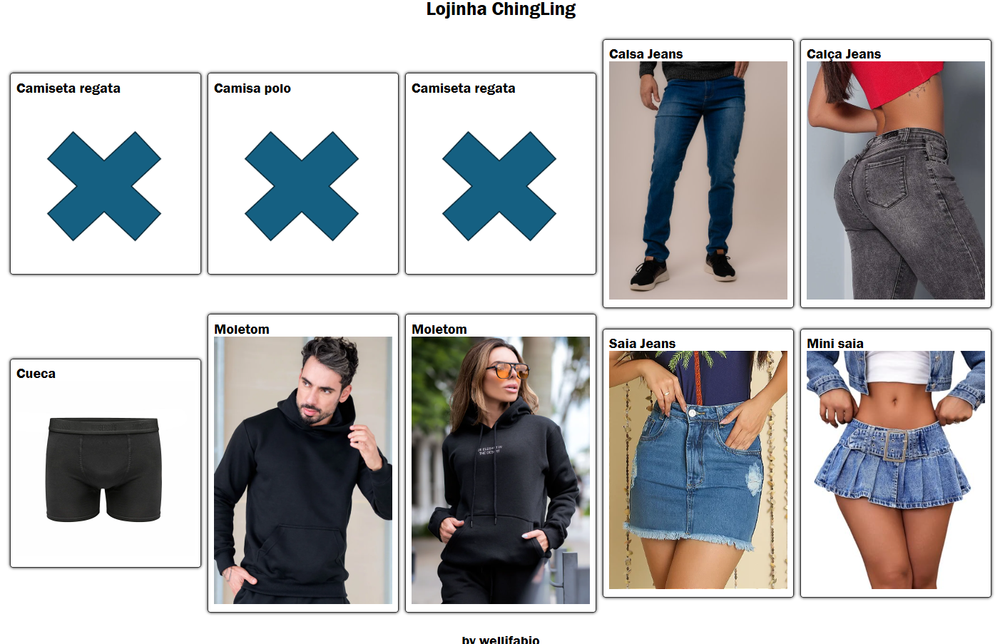

# Loginha ChingLing
Exemplo de consumo de dados via **Mockup**.

## Tecnologias
- HTML
- CSS
- JavaScript
- VsCode
    - Live Server
- JSON

## Passos para testar localmente
- Clone este repositorio
- Abra com VsCode e execute o indes.html com o Live server.

## Print da tela

